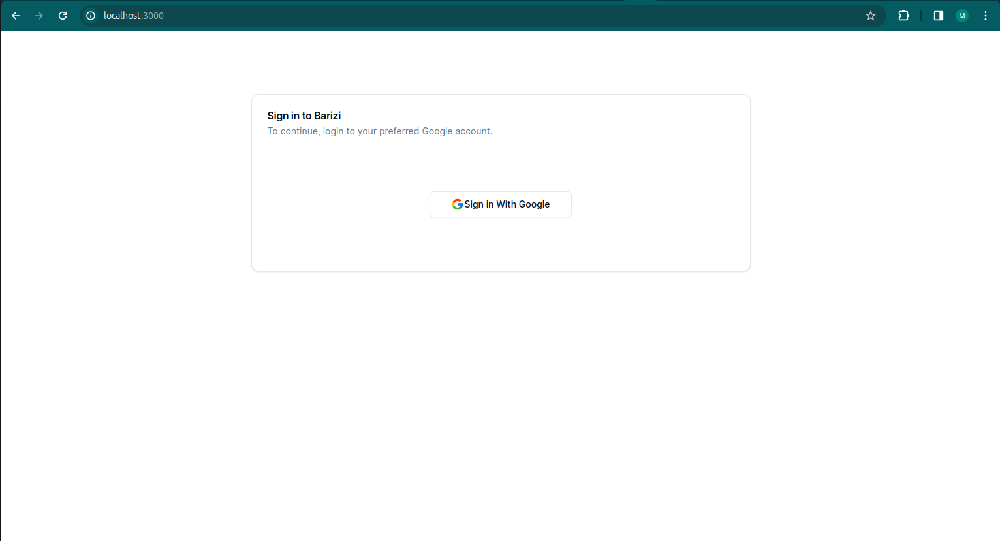

This is a [Next.js](https://nextjs.org/) project bootstrapped with [`create-next-app`](https://github.com/vercel/next.js/tree/canary/packages/create-next-app).

## Getting Started

First, run the server (Remember to start by running the backend application):

```bash
npm run dev
```

Open [http://localhost:3000](http://localhost:3000) with your browser to see the result.

## About this project
#### Overview
This is a demo project designed for Barizi Communications to demonstrate my
frontend design skills. 

#### Security
This application is secured by implementing openid connect using Google as the oauth provider. To achieve this
I chose to use authjs a complete open-source authentication solution for web applications.

#### Functionality
The following functionalities have beem included:
* Login
* Create Product
* List products
* Update product
* Update Inventory


## Screenshots

### Login Page


### Create Product


### List Products Page


### Update Invenory


### Update product

